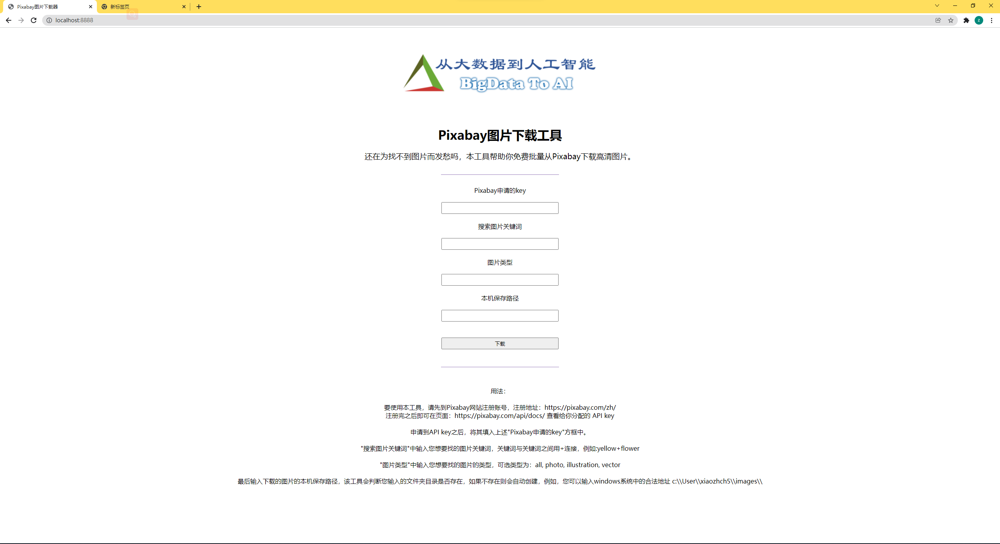

# Pixabay图片下载器

还在为找不到图片而发愁吗，本工具帮助你免费批量从Pixabay下载高清图片。



## 本地运行：

```bash
git clone http://github.com/xiaozhch5/gop-image-capture.git

cd gop-image-capture && gop run main.gop
```

## 执行构建：

```bash
gop build .
```

便可在当前目录下得到go+.exe文件

## 使用说明

要使用本工具，请先到Pixabay网站注册账号，注册地址：https://pixabay.com/zh/

注册完之后即可在页面：https://pixabay.com/api/docs/ 查看给你分配的 API key

申请到API key之后，将其填入上述"Pixabay申请的key"方框中。

"搜索图片关键词"中输入您想要找的图片关键词，关键词与关键词之间用+连接，例如:yellow+flower

"图片类型"中输入您想要找的图片的类型，可选类型为：all, photo, illustration, vector

最后输入下载的图片的本机保存路径，该工具会判断您输入的文件夹目录是否存在，如果不存在则会自动创建，例如，您可以输入windows系统中的合法地址 c:\\User\\xiaozhch5\\images\\